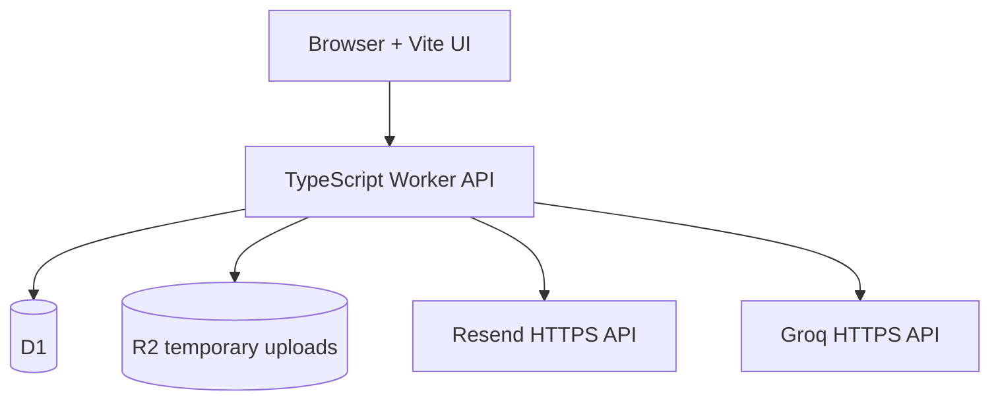

# FinView Sites Migration Design

**Spec**: `.specs/features/sites-migration/spec.md`
**Status**: Approved by implementation request

## Architecture Overview

O projeto `sites-app` será independente do Django. O frontend usa rotas no navegador e a API usa o mesmo origin, reduzindo CORS e mantendo cookies `HttpOnly`. O Worker concentra autenticação, autorização, validação e integrações. D1 armazena registros estruturados; R2 existe apenas durante a extração do arquivo.

## Code Reuse Analysis

| Component | Location | How to Use |
| --- | --- | --- |
| Command Center | `design-lab/command-center/` | Reutilizar hierarquia, conteúdo e tokens visuais. |
| Regras de perfil | `gastos/profile_service.py` | Portar faixas e tratamento de respostas ausentes. |
| Regras financeiras | `gastos/views.py` | Portar fórmulas, nunca importar dependências Django. |
| Importadores | `gastos/import_service.py` | Reproduzir contrato intermediário e validações em TypeScript. |
| Provedor Groq | `gastos/ia.py` | Preservar roteamento 120B/20B, timeout e sanitização. |

## Components

### Worker Router

- **Purpose**: Servir APIs, headers de segurança e assets do frontend.
- **Location**: `sites-app/src/worker.ts`
- **Interfaces**: `fetch(request, env): Promise<Response>`
- **Dependencies**: Hono, D1, R2.

### Auth Service

- **Purpose**: Solicitar e confirmar OTP, criar sessão e autorizar empresas.
- **Location**: `sites-app/src/services/auth.ts`
- **Interfaces**: `requestCode`, `verifyCode`, `requireSession`, `revokeSession`.
- **Dependencies**: Web Crypto, D1, Resend.

### Finance Service

- **Purpose**: CRUD e agregações financeiras determinísticas.
- **Location**: `sites-app/src/services/finance.ts`
- **Interfaces**: transactions, goals, dashboard summary.
- **Dependencies**: D1.

### Import Service

- **Purpose**: Validar, extrair, revisar e confirmar arquivos.
- **Location**: `sites-app/src/services/imports.ts`
- **Interfaces**: `createBatch`, `reviewBatch`, `confirmBatch`, `cancelBatch`.
- **Dependencies**: D1, R2, parsers, Groq opcional.

### AI Provider

- **Purpose**: Chamar Groq sem expor dados ou segredos.
- **Location**: `sites-app/src/services/groq.ts`
- **Interfaces**: `analyzeSummary`, `classifyDescriptions`.
- **Dependencies**: Fetch, AbortSignal.

### Web Client

- **Purpose**: Entregar as jornadas públicas e privadas do Command Center.
- **Location**: `sites-app/src/client/`
- **Interfaces**: API same-origin JSON e multipart.
- **Dependencies**: DOM, CSS e History API.

## Data Model Decisions

- UUID em texto para identificadores públicos.
- Dinheiro em `INTEGER` de centavos.
- E-mail normalizado com índice único.
- Sessões e códigos armazenam apenas hashes.
- Toda entidade financeira contém `business_id`.
- `import_rows.transaction_id` e índice único garantem confirmação idempotente.
- JSON é usado apenas para respostas versionadas e metadados variáveis.

## Error Handling Strategy

| Error Scenario | Handling | User Impact |
| --- | --- | --- |
| Resend indisponível | Log sanitizado e 503 genérico | Pode tentar novamente. |
| Groq indisponível | Retorno consultivo indisponível | Operação manual continua. |
| Dado de outra empresa | Consulta escopada retorna 404 | Nenhum vazamento de existência. |
| Arquivo inválido | Lote rejeitado e R2 removido | Motivo objetivo na tela. |
| Confirmação repetida | Transação e índice único | Nenhuma duplicação. |

## Risks & Concerns

| Concern | Location | Impact | Mitigation |
| --- | --- | --- | --- |
| Python não executa no Sites | `config/wsgi.py` | Aplicação atual não é implantável diretamente | Implementação TypeScript isolada. |
| Parsers XLS/PDF podem exceder limites do Worker | `gastos/import_service.py` | Formato pode falhar em produção | Fixture de compatibilidade e rejeição explícita antes do deploy. |
| Cadastro público pode gerar abuso de e-mail | novo auth | Custo e spam | Rate limit por e-mail/IP, resposta neutra e expiração curta. |
| Sites está em beta | plataforma | Limites e APIs podem mudar | Preservar Django e fixar dependências. |
| Retenção jurídica não está definida | AD-012 | Risco de privacidade | Remover bruto após extração e manter publicação privada até revisão. |

## Tech Decisions

| Decision | Choice | Rationale |
| --- | --- | --- |
| Runtime | TypeScript Worker | Forma full-stack compatível com Sites. |
| HTTP | Hono | Router pequeno e compatível com Workers. |
| Validação | Zod | Contratos explícitos e erros consistentes. |
| Frontend | Vite + TypeScript sem framework visual | Preserva HTML/CSS e reduz reescrita. |
| Testes | Vitest + Miniflare | Valida lógica e runtime Worker localmente. |
| Publicação | Save version antes de deploy | Separa candidato revisável de produção. |
